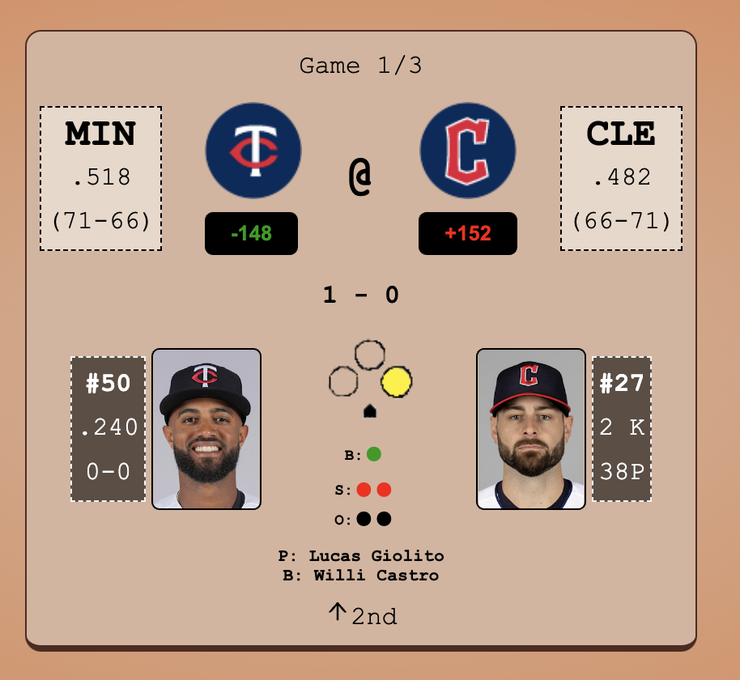

# MLBAPI 

## Table of Contents

### [Description](#Description)

### [Installation](#Installation)

### [Usage](#Usage)

### [Testing](#Testing)

### [Contributors](#Contributors)

### [License](#License)

### [Questions](#Questions)

## Description

This is the first stage of the AllSports app, it gives live play-by-play updates for all ongoing baseball games, allows users to review stats, and even place bets on games. More sports soon to follow!

## Installation

No installation is necessary, the site is deployed and fully functional at https://sports-app322.herokuapp.com/

## Usage

Simply navigate to the start page and follow the games. If you wish to place a bet, you must register for a free account.

## Testing

There is an extensive testing suite in the codebase using jest.

## Contributors

Just me

## License

MIT License

## Questions

Philip Neumann

https://github.com/moviefan322

philman202@yahoo.com
